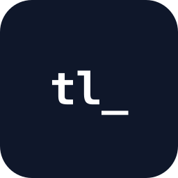

<p align="center">
  
</p>

<h1 align="center">TrustLists Plugin</h1>

<p align="center">
  Vendor security & compliance toolkit for Cursor and Claude Code.<br/>
  Look up trust centers, audit dependencies, and check vendor compliance — without leaving your editor.
</p>

<p align="center">
  <a href="LICENSE"></a>
  <a href="https://www.npmjs.com/package/@trustlists/mcp"></a>
</p>

## What it does

The TrustLists plugin gives your AI assistant access to a curated registry of 2,000+ company trust centers, plus tools to audit your project's dependencies for security posture.

### Tools

| Tool | What it does | Cost |
|------|--------------|------|
| `trustlists_search` | Search 2,000+ trust centers by name or domain | Free |
| `trustlists_lookup` | Look up a single vendor by exact domain | Free |
| `trustlists_audit_dependencies` | Audit `package.json`, `requirements.txt`, `go.mod`, etc. | Free |

### Skills

The plugin ships with skills your AI assistant uses automatically:

- **lookup-vendor** — Find a vendor's trust center, certifications, and security platform
- **audit-dependencies** — Scan your project for vendor security posture
- **compliance-quick-check** — Fast yes/no on a vendor's compliance status

## Example usage

In Cursor or Claude Code, just ask:

> "Look up Stripe's trust center"

> "Audit my package.json for vendor security"

> "Is Datadog HIPAA compliant?"

The AI uses the plugin's tools to answer with data from the TrustLists registry.

## Installation

### Cursor (Marketplace — coming soon)

1. Open Cursor's Marketplace panel
2. Search for "TrustLists"
3. Click Install

### Local development install

```bash
# Clone this repo
git clone https://github.com/trustlists/trustlists-plugin.git ~/.cursor/plugins/local/trustlists

# Restart Cursor
```

### Claude Code

The skills in this plugin are compatible with Claude Code. Copy `skills/` into your `.claude/skills/` directory.

## Pricing

The plugin and registry lookups are **free forever**. Optional Pro features (coming soon) connect to your TrustLists Companion account for AI-powered SOC 2 report analysis and trust center access automation.

- **Free** — Registry lookups, dependency audits, compliance checks
- **Pro features** (future): SOC 2 report analysis, AI vendor discovery, automated access requests

Visit [trustlists.org](https://trustlists.org) for the full directory and Companion subscriptions.

## Development

```bash
# Install dependencies
npm install

# Build the MCP server
npm run build

# Test locally
npm run test:local
```

See [docs/development.md](docs/development.md) for the full development guide.

## License

Apache 2.0. See [LICENSE](LICENSE) and [NOTICE](NOTICE).

## Links

- [TrustLists Directory](https://trustlists.org)
- [TrustLists Companion](https://app.trustlists.org)
- [Issues](https://github.com/trustlists/trustlists-plugin/issues)
