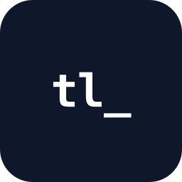

<p align="center">
  
</p>

<h1 align="center">trustlists_ Plugin</h1>

<p align="center">
  Public vendor trust center tools for Cursor and Claude Code.<br/>
  Find trust centers, analyze SOC 2 reports, and request vendor access without leaving your editor.
</p>

<p align="center">
  <a href="LICENSE"></a>
  <a href="https://www.npmjs.com/package/@trustlists/mcp"></a>
</p>

## What it does

The trustlists_ plugin gives your AI assistant access to thousands of public company
trust center records, local SOC 2 analysis, and SafeBase/Vanta access requests.

### Tools

| Tool | What it does | Cost |
|------|--------------|------|
| `trustlists_search` | Search thousands of trust centers by name or domain | Free |
| `trustlists_lookup` | Look up a single vendor by exact domain | Free |
| `trustlists_browse` | Filter by platform, listed framework, or CSA STAR level | Free |
| `trustlists_audit_dependencies` | Audit `package.json`, `requirements.txt`, `go.mod`, etc. | Free |
| `trustlists_login` / `whoami` / `logout` | Device-code sign-in (`~/.trustlists/auth.json`) | Free |
| `trustlists_soc2_analyze` / `status` / `report` | Analyze local SOC 2 PDFs after a credit preview | Credits |
| `trustlists_requester_profile` | Identity used on vendor access forms | Free |
| `trustlists_access_request` / `status` / `continue` / `request_batch` | Request SafeBase or Vanta access (max 5 per batch) | Free (beta) |

The hosted HTTP endpoint stays the three public directory tools. Account tools
only run on the local stdio server (`npx -y @trustlists/mcp`).

### Skills

The plugin ships with skills your AI assistant uses automatically:

- **lookup-vendor** - Find a vendor's trust center and listed frameworks
- **audit-dependencies** - Map project dependencies to public trust center records
- **compliance-quick-check** - Check whether a directory record lists a requested framework
- **sign-in** - Connect a trustlists account with a device code
- **analyze-soc2** - Preview credits, then analyze a local SOC 2 PDF
- **request-trust-center-access** - Complete the requester profile and request access

## Example usage

In Cursor or Claude Code, just ask:

> "Look up Stripe's trust center"

> "Audit my package.json for vendor security"

> "Does Datadog's trust center list HIPAA information?"

The AI uses the plugin's tools to answer with current public trustlists data.
A directory record is a discovery aid, not an audit, certification, endorsement,
or security rating.

## Quick Install (Cursor, Claude Desktop, Claude Code)

Add this to your MCP config and restart:

```json
{
  "mcpServers": {
    "trustlists": {
      "command": "npx",
      "args": ["-y", "@trustlists/mcp"]
    }
  }
}
```

| App | Config location |
|-----|-----------------|
| **Cursor** | Settings → MCP → Edit config (or `~/.cursor/mcp.json`) |
| **Claude Desktop** | `~/Library/Application Support/Claude/claude_desktop_config.json` |
| **Claude Code** | `~/.claude/settings.json` or `.claude/settings.json` in your project |

**[Full installation guide →](docs/INSTALL.md)** (includes troubleshooting)

## Pricing

The directory and audit tools are free and require no trustlists account. SOC 2
analysis and access requests use a device-code login on the local MCP.

- **Free MCP tools** - Search, lookup, browse, and dependency mapping
- **Signed-in MCP tools** - SOC 2 analysis (credits) and trust-center access requests
- **Companion** - The same account workflows in the browser at app.trustlists.org

Visit the [MCP overview](https://trustlists.org/mcp/) for setup and tool details,
or [trustlists.org](https://trustlists.org) for the full directory and Companion subscriptions.

## Development

```bash
# Install dependencies
npm install

# Build the MCP server
npm run build

# Test locally
npm run test:local
```

See [docs/development.md](docs/development.md) for the full development guide.

## License

Apache 2.0. See [LICENSE](LICENSE) and [NOTICE](NOTICE).

## Links

- [trustlists directory](https://trustlists.org)
- [trustlists Companion](https://app.trustlists.org)
- [Issues](https://github.com/trustlists/trustlists-plugin/issues)
